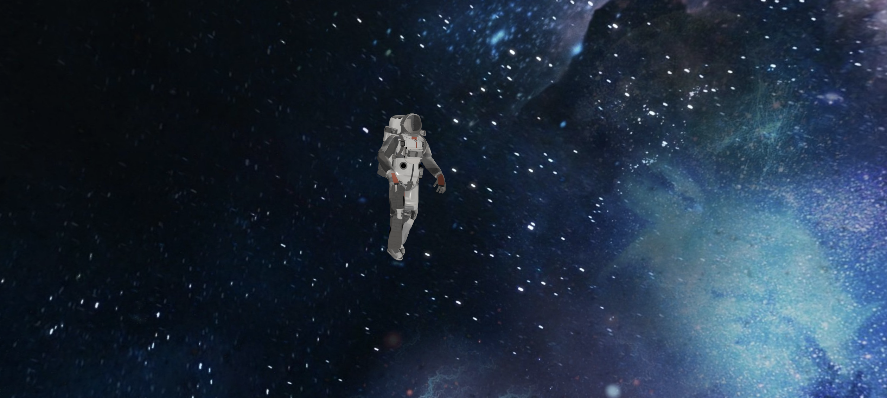

# 3D Floating Astronaut in Space

This project showcases a 3D floating astronaut model using **Three.js** and **React Three Fiber**. The astronaut model is animated and interacts with lighting and textures for a visually immersive space experience. The scene also includes a space background to enhance the effect.

## Demo



[3D Astronaut Model - Sketchfab](https://sketchfab.com/3d-models/animated-floating-astronaut-in-space-suit-loop-e2c4b146e58141e4b87917456a9970b1)

## Background Image

Background Image by [Alex Myers](https://pixabay.com/users/myersalex216-4979749/?utm_source=link-attribution&utm_medium=referral&utm_campaign=image&utm_content=2638158) from [Pixabay](https://pixabay.com//?utm_source=link-attribution&utm_medium=referral&utm_campaign=image&utm_content=2638158).

## Features

- 3D animated astronaut model with textures (color, normal, metalness, roughness, and AO).
- Dynamic lighting including ambient light, directional light, and spotlight to illuminate the model.
- Bloom effect for a subtle glowing visual effect.
- Interactive camera controls via `OrbitControls` for zoom and pan.

## Setup Instructions

### Prerequisites

Ensure you have the following installed:

- [Node.js](https://nodejs.org/en/) (LTS version recommended)

### Installation

1. **Clone the repository**:
   ```bash
   git clone repo_url
   ```

2. **Install dependencies**:
   ```bash
   npm install
   ```

3. **Start the development server**:
   ```bash
   npm start
   ```

4. Open your browser and go to `http://localhost:3000/` to view the 3D scene.

## Project Implementation


The code you provided implements a 3D floating astronaut in space using Three.js, React Three Fiber, and various textures. Below is an explanation of the code along with some minor improvements:

Key Aspects of the Code:
Astronaut Model:

The astronaut model (astronaut.glb) is loaded using useGLTF().
The model uses several textures (color, roughness, metalness, normal, and ambient occlusion).
Textures:

Color Texture: Adds base color to the astronaut model.
Roughness Texture: Determines how rough or smooth the surface of the astronaut is.
Metalness Texture: Controls how metallic the material looks.
Normal Texture: Adds surface detail to make the astronaut's surface look more realistic.
Ambient Occlusion (AO): Adds shadows in crevices to give the astronaut model more depth.
Lighting:

Ambient Light: Adds overall brightness to the scene.
Directional Light: Illuminates the astronaut from one direction, simulating sunlight.
Spot Light: Adds focused light on the astronaut to emphasize key areas.
Post-Processing:

Bloom: A bloom effect is used to create a subtle glow, enhancing the overall visual appeal.
Controls:

OrbitControls: Allows the user to interact with the scene by zooming and panning around the astronaut.
How to Use the Code:
Textures:
Ensure that all textures such as gltf_embedded_0.png, gltf_embedded_3@channels=R.png, etc., are placed in the correct folder (/public/textures/).
3D Model:
The astronaut .glb file should be located in the /public/ folder for the GLTF loader to work.


### 3D Model:

- The astronaut model is loaded from `/astronaut.glb`.

### Background Image:

- The background space image used in this project is provided by [Alex Myers on Pixabay](https://pixabay.com/users/myersalex216-4979749/?utm_source=link-attribution&utm_medium=referral&utm_campaign=image&utm_content=2638158).


Enjoy exploring space with the astronaut!

## Demo Video

To watch the demo video, [download it from this link](output_vid.mov).

